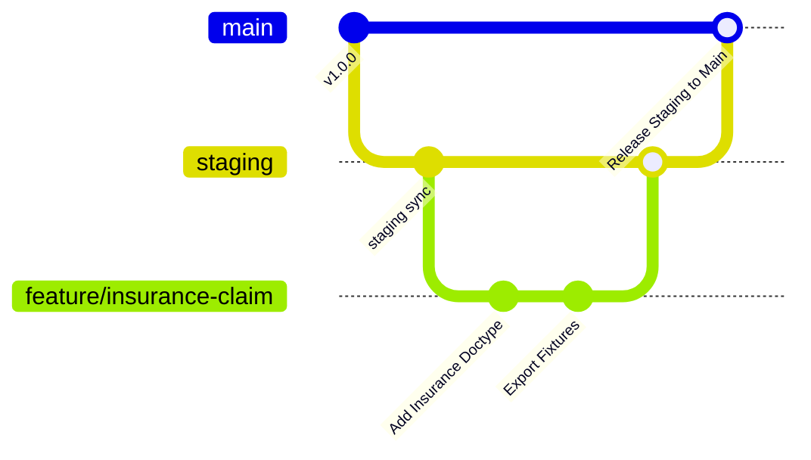

# AGENTS.md — Rules & Technical Governance for AI & Developers

> **PENTING UNTUK SELURUH DEVELOPER & AI ASSISTANT:**
> Dokumen ini memuat aturan hukum wajib yang **HARUS DIPATUHI** tanpa pengecualian saat membaca, merancang, mengedit, atau men-deploy kode di repositori **ERP-SMS**.

---

## 🛑 1. Aturan Emas (Golden Rules)

### Rule #1: ABSOLUTE ZERO CORE MUTATION
- **DILARANG KERAS** mengubah file apa pun di dalam folder `apps/frappe` atau `apps/erpnext`.
- Seluruh penambahan field, custom script, dokumen kustom, override controller, atau hook **WAJIB** berada di dalam folder app kustom: `apps/sms_aftersales`.
- Jika membutuhkan perubahan perilaku modul standar ERPNext, gunakan **Frappe Hooks** (`override_doctype_class`, `doc_events`, `custom_app_fixtures`, dll).

### Rule #2: FIXTURES UNTUK SEMUA PERUBAHAN METADATA
- Jangan pernah mengubah schema database secara langsung via SQL query (`ALTER TABLE`).
- Setiap kali menambah `Custom Field`, `Property Setter`, `Custom DocPerm`, atau `Print Format` via Desk UI ERPNext, jalankan segera perintah:
  ```bash
  bench --site [nama-site] export-fixtures
  ```
  File JSON fixture akan tersimpan di `apps/sms_aftersales/sms_aftersales/fixtures/` dan **harus di-commit ke Git**.

### Rule #3: TRANSACTION INTEGRITY & NO FLOATING DATA
- Seluruh kode Python yang memanipulasi Stok (`Stock Entry`, `Stock Ledger`) dan Keuangan (`Journal Entry`, `GL Entry`) wajib dibungkus dalam transaksi database bawaan Frappe (`frappe.db.commit()` / `frappe.db.rollback()` otomatis oleh controller).
- Gunakan `doc.insert()`, `doc.submit()`, atau `doc.cancel()` alih-alih melakukan query SQL `INSERT/UPDATE` langsung ke tabel transaksi.

---

## 📐 2. Konvensi Penamaan & Struktur Kode (Naming Conventions)

### A. Custom Doctype Naming
- Gunakan format **Title Case** dengan spasi yang jelas: `SMS Insurance Policy`, `SMS Service Intake`, `SMS Claim Settlement`.
- Prefix `SMS` wajib digunakan pada Doctype kustom baru untuk menghindari tabrakan nama (*namespace collision*) jika di masa depan ERPNext merilis modul bernama mirip.

### B. Python Coding Style
- Ikuti standar **PEP 8**.
- Gunakan Type Hints jika memungkinkan.
- Jangan gunakan `frappe.db.sql()` jika query bisa diselesaikan menggunakan `frappe.get_all()` atau `frappe.get_doc()`.
- Setiap query SQL mentah **WAJIB** menggunakan parameterized query untuk mencegah SQL Injection:
  ```python
  # BENAR:
  frappe.db.sql("SELECT name FROM `tabCustomer` WHERE status = %s", (status,))

  # SALAH (DILARANG):
  frappe.db.sql(f"SELECT name FROM `tabCustomer` WHERE status = '{status}'")
  ```

### C. Client Script (JavaScript Style)
- Gunakan struktur standar Frappe Form Scripts:
  ```javascript
  frappe.ui.form.on('SMS Service Intake', {
      refresh(frm) {
          // Custom UI Logic
      },
      customer(frm) {
          // Field Trigger Event
      }
  });
  ```
- Jangan melakukan AJAX manual menggunakan `fetch()` atau `jQuery.ajax()`. Gunakan `frappe.call()` bawaan framework.

---

## 🌿 3. Konvensi Git & Branching Strategy



1. **`main` Branch:** Branch produksi (Live). Hanya menerima Pull Request dari `staging` setelah melalui UAT Sign-off.
2. **`staging` Branch:** Branch integrasi & testing. Tempat pengujian fitur gabungan sebelum masuk ke live.
3. **`feature/[nama-divisi]-[nama-fitur]`:** Branch pengembangan dev lokal (contoh: `feature/insurance-claim-workflow`, `feature/warehouse-serial-tracking`).
4. **`bugfix/[ticket-id]`:** Branch khusus perbaikan bug.

### Commit Message Standards:
Gunakan Conventional Commits format:
- `feat(insurance): add claim approval workflow`
- `fix(warehouse): resolve stock balance mismatch on serial transfer`
- `docs(prd): update HRD technician bonus requirement`
- `chore(fixtures): export new custom fields for service intake`

---

## 🧪 4. Aturan Pengujian Sebelum Commit (Pre-Commit Protocol)

Sebelum developer atau AI Assistant membuat commit/pull request, langkah wajib berikut harus lulus:

1. **Jalankan Linter & Formatter:**
   ```bash
   bench --site sms-dev.local run-tests --app sms_aftersales
   ```
2. **Periksa Status Fixtures:**
   Pastikan file JSON di `apps/sms_aftersales/sms_aftersales/fixtures/` sudah diperbarui jika ada perubahan Custom Field di UI.
3. **Pastikan No Broken Dependencies:**
   Jalankan `bench migrate` di environment dev bersih untuk memastikan semua Doctype kustom ter-build tanpa error SQL.
