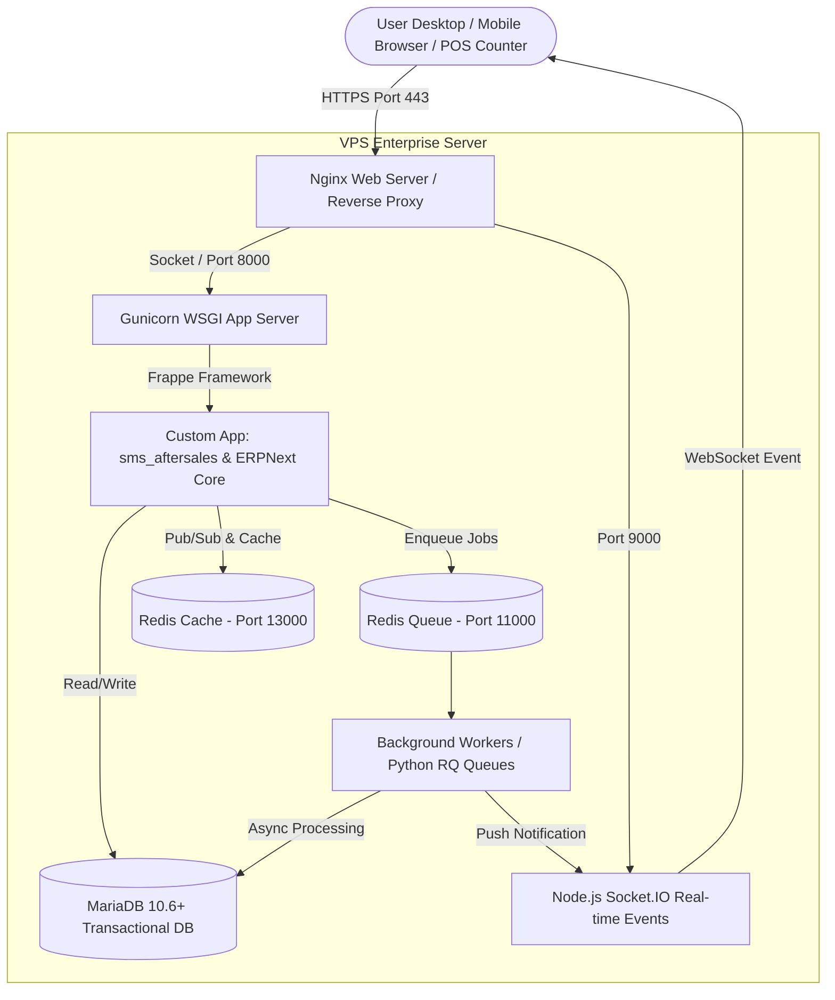

# ARCHITECTURE.md — System & Application Architecture Blueprint

## 🏛️ 1. High-Level System Architecture

Sistem **ERP-SMS** dibangun di atas ekosistem **Frappe v15 & ERPNext v15**. Seluruh arsitektur memisahkan antara layer penyimpan data, eksekusi latar belakang (background jobs), real-time notification socket, dan reverse proxy Nginx.



---

## 📂 2. Struktur Modul & Custom App Directory Layout

Aplikasi kustom `sms_aftersales` memiliki modul internal yang diisolasi berdasarkan divisi dan domain fungsi:

```
apps/sms_aftersales/
├── sms_aftersales/
│   ├── hooks.py                        <-- Central Frappe Integration Event Hooks
│   ├── patches.txt                     <-- DB Migration Patch Registry
│   ├── fixtures/                       <-- Custom Fields, Property Setters JSON
│   │   ├── custom_field.json
│   │   └── property_setter.json
│   ├── insurance/                      <-- Divisi Asuransi Modul
│   │   ├── doctype/
│   │   │   ├── sms_insurance_policy/
│   │   │   └── sms_insurance_claim/
│   ├── retail_network/                 <-- Divisi Retail & Service Center Network
│   │   ├── doctype/
│   │   │   ├── sms_service_intake/
│   │   │   └── sms_network_node/
│   ├── hr_service/                     <-- Divisi HRD & Teknisi Integration
│   │   ├── doctype/
│   │   │   └── sms_technician_log/
│   ├── api/                            <-- REST API Endpoints untuk Mobile/External Integrasi
│   │   ├── v1/
│   │   │   ├── claim.py
│   │   │   └── intake.py
│   └── public/                         <-- Static Assets (CSS, JS, Custom UI Widgets)
│       ├── js/
│       └── css/
```

---

## 🔄 3. Integritas Hooks & Override Strategy

Untuk memperluas atau mengubah perilaku standar ERPNext tanpa mengubah kodenya, file `hooks.py` dikonfigurasi sebagai berikut:

```python
# apps/sms_aftersales/sms_aftersales/hooks.py

app_name = "sms_aftersales"
app_title = "SMS After Sales System"
app_publisher = "SMS Team"

# 1. Export Fixtures Otomatis
fixtures = [
    {"dt": "Custom Field", "filters": [["module", "=", "SMS Aftersales"]]},
    {"dt": "Property Setter", "filters": [["module", "=", "SMS Aftersales"]]},
    {"dt": "Role Profile", "filters": [["role_profile", "like", "SMS %"]]}
]

# 2. Event Hooks Dokumen Standar ERPNext
doc_events = {
    "Serial No": {
        "on_update": "sms_aftersales.retail_network.events.sync_serial_warranty"
    },
    "Stock Entry": {
        "on_submit": "sms_aftersales.warehouse.events.validate_aftersales_parts_dispatch"
    }
}

# 3. Override Class Controller jika dibutuhkan (Dikalibrasi ketat)
override_doctype_class = {
    # "Issue": "sms_aftersales.overrides.custom_issue.CustomIssue"
}
```

---

## ⚡ 4. Background Processing & Caching Strategy

1. **Redis Cache (Port 13000):**
   - Digunakan untuk *in-memory caching* master data (misal daftar suku cadang populer, limit pertanggungan asuransi).
   - Penggunaan di Python: `frappe.cache().hget("insurance_limit", policy_no)`.

2. **Frappe RQ (Redis Queue - Background Jobs):**
   - **Queue `default`:** Eksekusi pengiriman email notifikasi status garansi & pembuatan otomatis draft Journal Entry.
   - **Queue `long`:** Generate laporan bulanan klaim asuransi lintas cabang dan sinkronisasi stok masif.

---

## 🌐 5. REST API Architecture (Integrasi Mobile / External App)

Sistem ERP-SMS menyediakan endpoint terenkripsi berbasis Token Auth / OAuth2:

```
POST /api/method/sms_aftersales.api.v1.intake.create_service_intake
Headers:
  Authorization: token [api_key]:[api_secret]
  Content-Type: application/json

Payload:
{
  "customer": "CUST-2026-0001",
  "serial_no": "SN-IPHONE15-88329",
  "issue_description": "Layar pecah dan baterai tidak bisa diisi daya",
  "insurance_claim_required": 1
}
```
*Response:*
```json
{
  "status": "success",
  "message": "Service Intake Created Successfully",
  "intake_id": "INTAKE-2026-00089",
  "claim_status": "Pending Verification"
}
```
