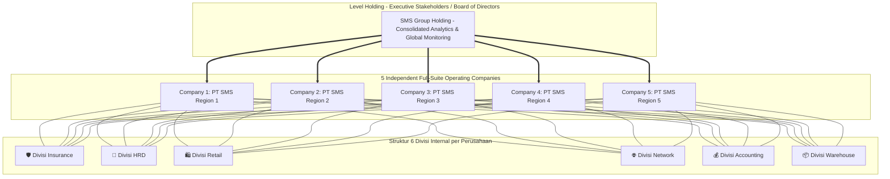

# ARCHITECTURE.md — System & Application Architecture Blueprint

## 🏛️ 1. Multi-Company Matrix Architecture

Sistem **ERP-SMS** dirancang menggunakan arsitektur **Multi-Company Full Matrix Holding Group**. Dalam arsitektur ini, **setiap Perusahaan (Subsidiary Entity)** beroperasi sebagai entitas bisnis mandiri yang memiliki **6 Divisi Internal Lengkap** di dalam struktur organisasinya sendiri:



---

## 🔒 2. Matriks Struktur Organisasi di ERPNext (Company & Department Hierarchy)

Pemetaan hirarki di Frappe/ERPNext dikonfigurasi sebagai berikut:

```
Frappe Core Organization Structure:
├── Company: PT SMS Region 1 (Surabaya)
│   ├── Department: Insurance - PT 1
│   ├── Department: HRD - PT 1
│   ├── Department: Retail - PT 1
│   ├── Department: Network - PT 1
│   ├── Department: Accounting - PT 1
│   └── Department: Warehouse - PT 1
│       └── Warehouse: Main Spareparts - PT 1
├── Company: PT SMS Region 2 (Jakarta)
│   ├── Department: Insurance - PT 2
│   ├── Department: HRD - PT 2
│   ├── Department: Retail - PT 2
│   ├── Department: Network - PT 2
│   ├── Department: Accounting - PT 2
│   └── Department: Warehouse - PT 2
│       └── Warehouse: Main Spareparts - PT 2
... (Berlaku persis sama hingga PT SMS Region 5)
```

---

## 🔍 3. Data Isolation Matrix (Company + Department Isolation)

- **Staf Divisi Retail di PT 1:** Hanya bisa mengakses data penerimaan barang (`SMS Service Intake`) di `Company = PT 1` dan `Department = Retail`.
- **Manager Divisi Insurance di PT 2:** Hanya bisa melakukan approval klaim (`SMS Insurance Claim`) di `Company = PT 2`.
- **Stakeholder Holding:** Memiliki hak akses lintas 5 Perusahaan dan 6 Divisi tanpa batasan (`Full Consolidated Access`).
