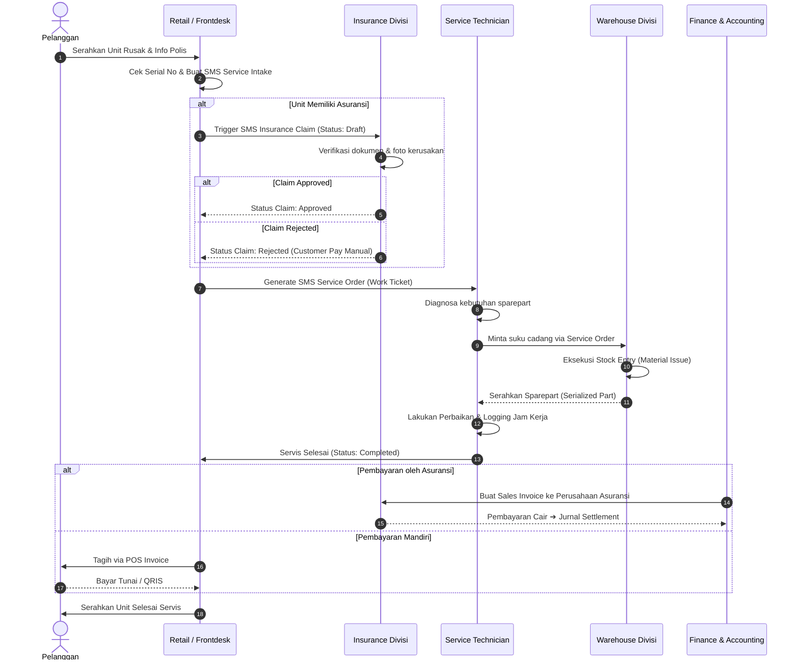
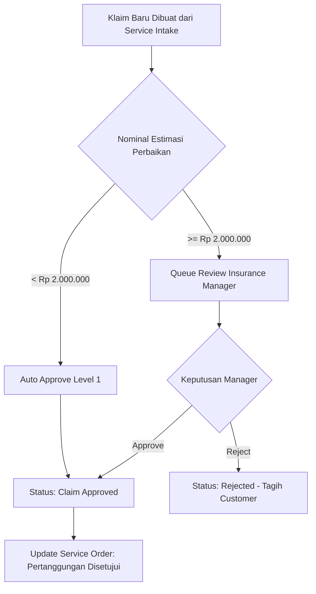
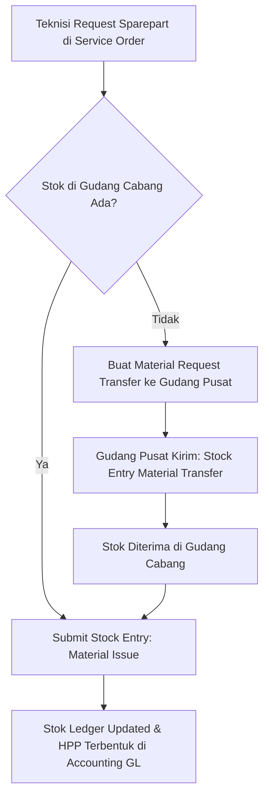

# BUSINESS_PROCESS_FLOW.md — End-to-End Business Workflows

## 🔄 1. Master After-Sales Service & Insurance Workflow

Diagram urutan berikut menjelaskan alur transaksi lengkap dari kedatangan pelanggan hingga penutupan jurnal keuangan:

---

## 🛠️ 2. Detailed Workflows per Process

### A. Sub-Process: Insurance Claim Approval Flow

### B. Sub-Process: Sparepart Transfer & Stock Accounting

---

## 📊 3. Matrix Dokumentasi & Output per Tahap

| Tahapan | Dokumen ERPNext yang Dihasilkan | Penanggung Jawab | Trigger Otomatis |
|---|---|---|---|
| 1. Reception | `SMS Service Intake` | Frontdesk Retail | Notifikasi WhatsApp/Email ke Customer |
| 2. Claim Assesment | `SMS Insurance Claim` | Insurance Specialist | Lock Limit Polis Asuransi |
| 3. Execution | `SMS Service Order` | Service Lead | Alokasi Teknisi berdasarkan Skill |
| 4. Parts Allocation| `Stock Entry (Material Issue)`| Warehouse Keeper | Potong Stok Serialized Parts |
| 5. Invoicing | `Sales Invoice` / `POS Invoice`| Finance / Kasir | Update Piutang Customer/Asuransi |
| 6. Settlement | `Journal Entry` | Accounting Specialist | Pengakuan Kas & Pelunasan Piutang |
