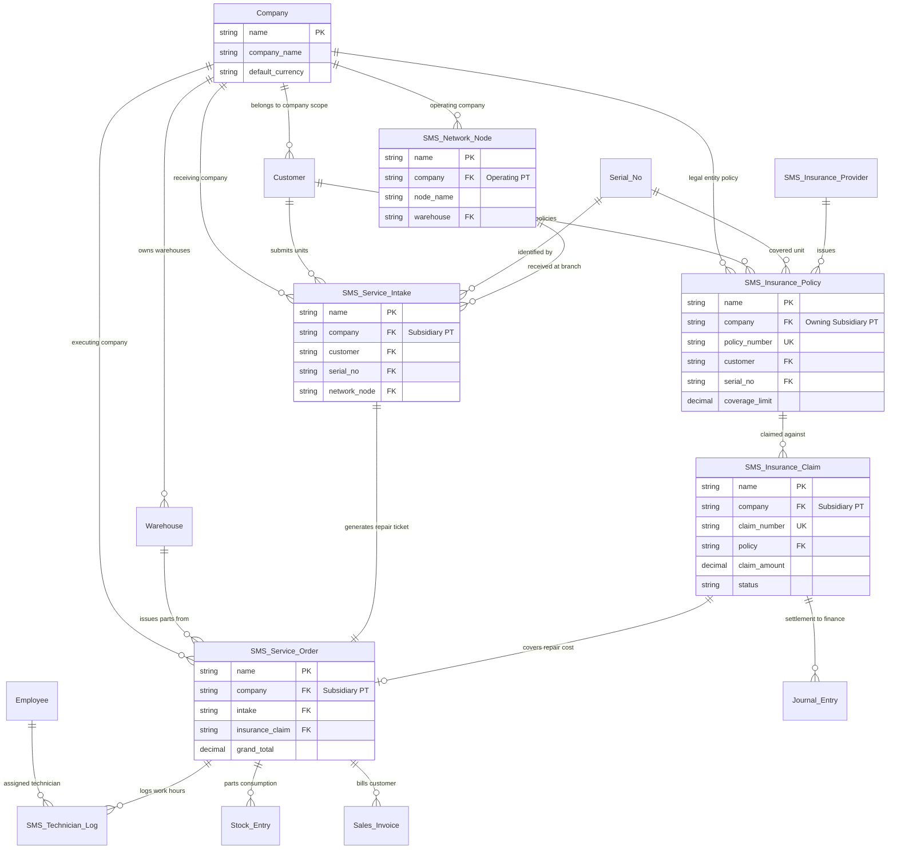

# ERD_AND_DATA_DICTIONARY.md — Entity Relationship Diagram & Data Dictionary (Multi-Company Enabled)

## 📊 1. Multi-Company Entity Relationship Diagram (ERD Overview)

Berikut adalah diagram relasi entitas antara **Custom Doctypes (SMS Modul)**, **Entitas Multi-Company Native ERPNext (`Company`)**, dan Doctype standar lainnya:

---

## 📖 2. Data Dictionary (Kamus Data Detail — Multi-Company Aware)

### A. Custom Doctype: `SMS Insurance Policy`
| Field Name | Label UI | Field Type | Options / Reference | Mandatory | Deskripsi |
|---|---|---|---|---|---|
| `name` | Policy ID | Data | Autoname: `POL-.YYYY.-.#####` | Yes (Auto) | Primary Key |
| `company` | Perusahaan (PT) | Link | `Company` | Yes | Foreign Key ke PT Anak Perusahaan |
| `policy_number` | No. Polis Asuransi | Data | Unique Index | Yes | Nomor polis dari partner |
| `customer` | Pelanggan | Link | `Customer` | Yes | Foreign Key ke Pelanggan |
| `serial_no` | Nomor Seri Barang | Link | `Serial No` | Yes | Unique Serial Number unit |
| `insurance_provider` | Penyedia Asuransi | Link | `SMS Insurance Provider` | Yes | Perusahaan asuransi |
| `coverage_limit` | Limit Pertanggungan | Currency | IDR | Yes | Batas maksimal klaim |
| `valid_start` | Tanggal Mulai | Date | - | Yes | Tanggal awal polis |
| `valid_expiry` | Tanggal Kadaluarsa | Date | - | Yes | Tanggal akhir polis |

---

### B. Custom Doctype: `SMS Insurance Claim`
| Field Name | Label UI | Field Type | Options / Reference | Mandatory | Deskripsi |
|---|---|---|---|---|---|
| `name` | Claim ID | Data | Autoname: `CLM-.YYYY.-.#####` | Yes (Auto) | Primary Key Klaim |
| `company` | Perusahaan (PT) | Link | `Company` | Yes | Legal Entity Pemroses Klaim |
| `policy` | Polis Terkait | Link | `SMS Insurance Policy` | Yes | Reference Polis |
| `service_order` | Service Order ID | Link | `SMS Service Order` | Yes | Reference Order |
| `claim_amount` | Nominal Klaim | Currency | IDR | Yes | Total disetujui |
| `claim_status` | Status Klaim | Select | `Draft\nSubmitted\nApproved\nRejected\nSettled` | Yes | Workflow Status |

---

### C. Custom Doctype: `SMS Service Intake`
| Field Name | Label UI | Field Type | Options / Reference | Mandatory | Deskripsi |
|---|---|---|---|---|---|
| `name` | Intake No | Data | Autoname: `INT-.YYYY.-.#####` | Yes (Auto) | Primary Key Intake |
| `company` | Perusahaan (PT) | Link | `Company` | Yes | PT Penerima Unit |
| `customer` | Nama Pelanggan | Link | `Customer` | Yes | Pemilik Barang |
| `network_node` | Pos Penerima | Link | `SMS Network Node` | Yes | Gerai Penerima |
| `serial_no` | No. Seri Unit | Link | `Serial No` | Yes | Unit Rusak |

---

### D. Custom Doctype: `SMS Service Order`
| Field Name | Label UI | Field Type | Options / Reference | Mandatory | Deskripsi |
|---|---|---|---|---|---|
| `name` | Service Order ID | Data | Autoname: `SVO-.YYYY.-.#####` | Yes (Auto) | Ticket Kerja |
| `company` | Perusahaan (PT) | Link | `Company` | Yes | PT Pelaksana Servis |
| `intake` | Service Intake | Link | `SMS Service Intake` | Yes | Reference Intake |
| `assigned_technician`| Lead Teknisi | Link | `Employee` | Yes | Teknisi PJ |
| `parts_warehouse` | Gudang Sparepart | Link | `Warehouse` | Yes | Gudang milik PT ini |
| `grand_total` | Total Biaya | Currency | Read Only | Yes | Total tagihan |

---

### E. Custom Doctype: `SMS Network Node`
| Field Name | Label UI | Field Type | Options / Reference | Mandatory | Deskripsi |
|---|---|---|---|---|---|
| `name` | Node ID | Data | Autoname: `NODE-.###` | Yes (Auto) | Primary Key Node |
| `company` | Perusahaan (PT) | Link | `Company` | Yes | PT Pemilik Cabang/Gerai |
| `node_name` | Nama Cabang/Mitra | Data | - | Yes | Nama Gerai |
| `warehouse` | Gudang Terikat | Link | `Warehouse` | Yes | Gudang milik PT ini |
| `cost_center` | Cost Center | Link | `Cost Center` | Yes | Cost center milik PT ini |
