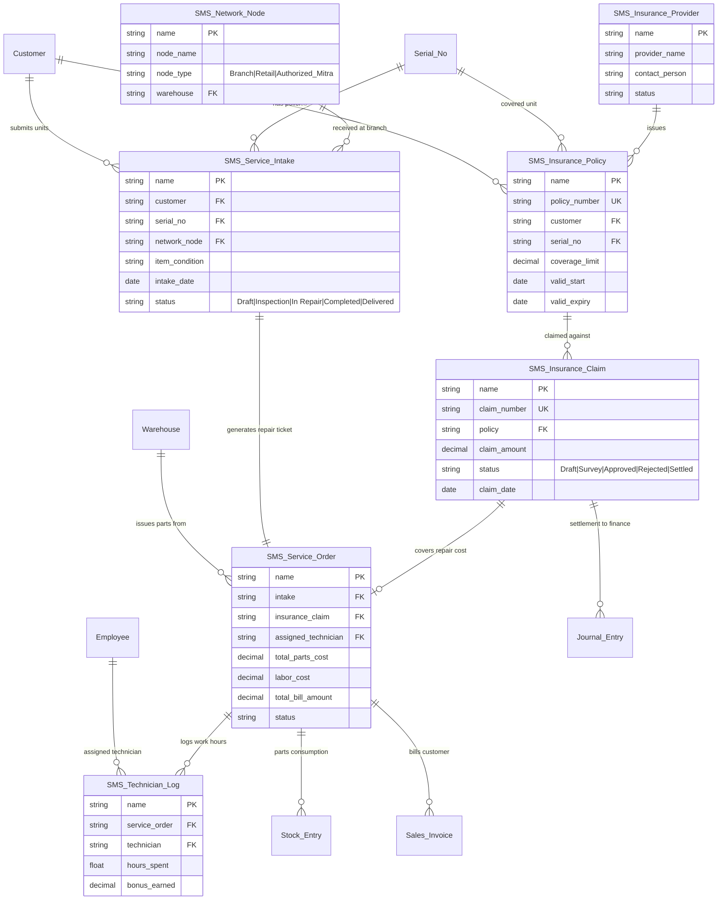

# ERD_AND_DATA_DICTIONARY.md — Entity Relationship Diagram & Data Dictionary

## 📊 1. Entity Relationship Diagram (ERD Overview)

Berikut adalah diagram relasi entitas antara **Custom Doctypes (SMS Modul)** dengan **Doctype Native ERPNext**:

---

## 📖 2. Data Dictionary (Kamus Data Detail)

### A. Custom Doctype: `SMS Insurance Policy`
*Tujuan:* Menyimpan data polis asuransi unit barang milik pelanggan.

| Field Name | Label UI | Field Type | Options / Reference | Mandatory | Deskripsi |
|---|---|---|---|---|---|
| `name` | Policy ID | Data | Autoname: `POL-.YYYY.-.#####` | Yes (Auto) | Primary Key unik polis |
| `policy_number` | No. Polis Asuransi | Data | Unique Index | Yes | Nomor polis dari partner |
| `customer` | Pelanggan | Link | `Customer` | Yes | Foreign Key ke tabel Pelanggan |
| `serial_no` | Nomor Seri Barang | Link | `Serial No` | Yes | Unique Serial Number unit |
| `insurance_provider` | Penyedia Asuransi | Link | `SMS Insurance Provider` | Yes | Perusahaan asuransi penerbit |
| `coverage_limit` | Limit Pertanggungan | Currency | IDR | Yes | Batas maksimal nilai klaim |
| `valid_start` | Tanggal Mulai | Date | - | Yes | Tanggal awal polis aktif |
| `valid_expiry` | Tanggal Kadaluarsa | Date | - | Yes | Tanggal akhir polis |
| `status` | Status Polis | Select | `Active\nExpired\nCancelled` | Yes | Default: `Active` |

---

### B. Custom Doctype: `SMS Insurance Claim`
*Tujuan:* Mengelola pengajuan klaim perbaikan/ganti unit ke pihak asuransi.

| Field Name | Label UI | Field Type | Options / Reference | Mandatory | Deskripsi |
|---|---|---|---|---|---|
| `name` | Claim ID | Data | Autoname: `CLM-.YYYY.-.#####` | Yes (Auto) | Primary Key Klaim |
| `policy` | Polis Terkait | Link | `SMS Insurance Policy` | Yes | Reference Polis Pelanggan |
| `service_order` | Service Order ID | Link | `SMS Service Order` | Yes | Reference order servis terkait |
| `claim_amount` | Nominal Klaim | Currency | IDR | Yes | Total biaya disetujui asuransi |
| `claim_status` | Status Klaim | Select | `Draft\nSubmitted\nApproved\nRejected\nSettled` | Yes | Workflow Status Klaim |
| `approval_date` | Tgl Persetujuan | Date | - | No | Diisi saat status Approved |
| `settlement_entry` | Journal Settlement | Link | `Journal Entry` | No | Reff Jurnal Keuangan pasca cair |

---

### C. Custom Doctype: `SMS Service Intake`
*Tujuan:* Dokumen tanda terima fisik barang rusak dari pelanggan di konter Retail/Network.

| Field Name | Label UI | Field Type | Options / Reference | Mandatory | Deskripsi |
|---|---|---|---|---|---|
| `name` | Intake No | Data | Autoname: `INT-.YYYY.-.#####` | Yes (Auto) | Tanda Terima Servis |
| `customer` | Nama Pelanggan | Link | `Customer` | Yes | Pemilik Barang |
| `network_node` | Pos Penerima | Link | `SMS Network Node` | Yes | Cabang/Toko Penerima |
| `serial_no` | No. Seri Unit | Link | `Serial No` | Yes | Unit yang akan diservis |
| `physical_condition` | Kondisi Fisik | Small Text | - | Yes | Catatan lecet/kelengkapan |
| `reported_issue` | Keluhan Masalah | Text | - | Yes | Deskripsi keluhan pelanggan |
| `is_insurance_claim` | Pakai Asuransi? | Check | - | No | Checkbox Klaim Asuransi |

---

### D. Custom Doctype: `SMS Service Order`
*Tujuan:* Dokumen kerja utama (Work Order) yang mengoordinasikan pengerjaan teknisi, alokasi sparepart, dan invoice.

| Field Name | Label UI | Field Type | Options / Reference | Mandatory | Deskripsi |
|---|---|---|---|---|---|
| `name` | Service Order ID | Data | Autoname: `SVO-.YYYY.-.#####` | Yes (Auto) | Nomor Ticket Kerja |
| `intake` | Service Intake | Link | `SMS Service Intake` | Yes | FK Dokumen Intake |
| `assigned_technician`| Lead Teknisi | Link | `Employee` | Yes | Teknisi Penangung Jawab |
| `parts_warehouse` | Gudang Sparepart | Link | `Warehouse` | Yes | Asal penarikan suku cadang |
| `spareparts_cost` | Biaya Part | Currency | Read Only | Yes | Auto-calculate dari Stock Entry |
| `labor_cost` | Biaya Jasa Servis | Currency | IDR | Yes | Input Jasa |
| `grand_total` | Total Biaya | Currency | Read Only | Yes | `spareparts_cost` + `labor_cost` |
| `status` | Status Pengerjaan | Select | `Open\nIn Progress\nWaiting Parts\nCompleted\nInvoiced` | Yes | Status Pengerjaan |

---

### E. Custom Doctype: `SMS Network Node`
*Tujuan:* Master data cabang, gerai retail, dan mitra servis resmi.

| Field Name | Label UI | Field Type | Options / Reference | Mandatory | Deskripsi |
|---|---|---|---|---|---|
| `name` | Node ID | Data | Autoname: `NODE-.###` | Yes (Auto) | ID Unik Cabang/Mitra |
| `node_name` | Nama Cabang/Mitra | Data | - | Yes | Nama Gerai / Mitra |
| `node_type` | Tipe Jaringan | Select | `Own Branch\nRetail Store\nAuthorized Partner` | Yes | Jenis Kepemilikan |
| `warehouse` | Gudang Terikat | Link | `Warehouse` | Yes | Lokasi Stok Cabang Ini |
| `cost_center` | Cost Center | Link | `Cost Center` | Yes | Perekaman Laba/Rugi |
