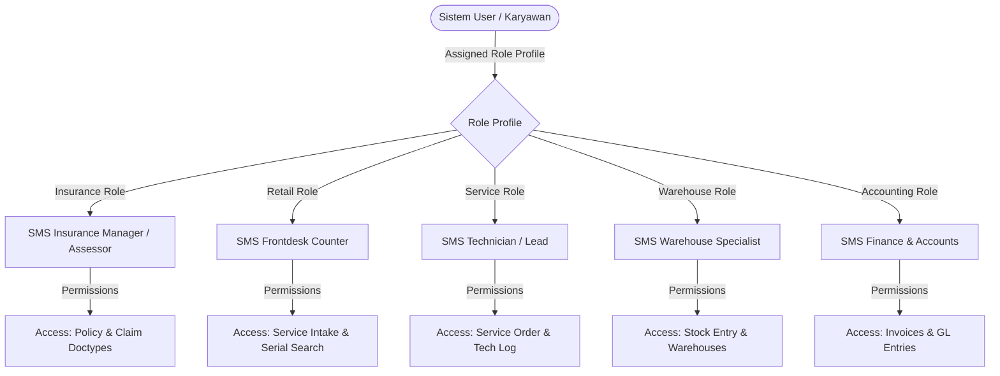

# SECURITY_AND_PERMISSIONS.md — Security & Access Control Framework

## 🔐 1. Role-Based Access Control (RBAC) Architecture

Sistem **ERP-SMS** membagi perizinan pengguna berdasarkan perannya (*Roles*) untuk memastikan prinsip *Least Privilege Access* (Hanya memberikan akses yang minimal dibutuhkan).



---

## 🛡️ 2. Daftar Peran (Roles Profile Matrix)

| Nama Role Profile | Terikat ke Divisi | Hak Akses Utama (Create / Read / Write / Submit / Cancel) |
|---|---|---|
| **SMS Insurance Assessor** | Insurance | `SMS Insurance Claim` (C, R, W, S), `SMS Insurance Policy` (R) |
| **SMS Insurance Manager** | Insurance | `SMS Insurance Claim` (C, R, W, S, C), `SMS Insurance Policy` (C, R, W, S) |
| **SMS Counter Desk** | Retail | `SMS Service Intake` (C, R, W), `Customer` (C, R, W), `Serial No` (R) |
| **SMS Service Technician** | HRD / Service | `SMS Service Order` (R, W - Log Hours), `Stock Entry` (Request Parts) |
| **SMS Warehouse Manager** | Warehouse | `Stock Entry` (C, R, W, S), `Serial No` (C, R, W), `Warehouse` (R, W) |
| **SMS Accounts Officer** | Accounting | `Sales Invoice` (C, R, W, S), `Journal Entry` (C, R, W, S) |

---

## 🔍 3. Data Isolation dengan User Permissions (Multi-Cabang Safety)

Untuk memastikan staf dari **Gerai Cabang Surabaya** tidak dapat melihat data transaksi **Gerai Cabang Jakarta**, Frappe **User Permissions** dikonfigurasi secara ketat:

### Aturan Isolation:
Setiap User diset perizinannya berdasarkan field `Branch` atau `Warehouse`:

```python
# Script otomatis penetapan User Permission saat User baru dibuat:
def setup_user_branch_permission(user_email, branch_name):
    user_perm = frappe.new_doc("User Permission")
    user_perm.user = user_email
    user_perm.allow = "SMS Network Node"
    user_perm.for_value = branch_name
    user_perm.apply_to_all_doctypes = 1
    user_perm.insert()
```

---

## 📜 4. Audit Trail & Track Changes (Pencatatan Jejak Aktivitas)

Seluruh Doctype kustom dalam modul `sms_aftersales` wajib mengaktifkan opsi `Track Changes` di JSON definition:

```json
{
  "track_changes": 1,
  "track_views": 1,
  "track_seen": 1
}
```

### Manfaat Track Changes:
1. **Version History:** Setiap kali perubahan angka limit klaim, nominal invoice, atau status approval disetujui, Frappe menyimpan riwayat dokumen (*Version Doctype*) yang mencatat:
   - Siapa yang mengubah data (`User ID`).
   - Kapan perubahan terjadi (`Timestamp`).
   - Nilai sebelum (*Old Value*) dan nilai setelah (*New Value*).
2. **Activity Log:** Log otomatis mencatat setiap pencarian data pelanggan atau pencetakan struk untuk mencegah kebocoran data (*Data Exfiltration*).

---

## 🔑 5. API Security & Rate Limiting

Untuk pengaksesan via REST API oleh aplikasi mobile atau pihak luar:
1. **Authentication:** Menggunakan **OAuth2** atau **API Key + Secret** berdurasi terbatas.
2. **Rate Limiting:** Dibatasi maksimal **100 request/menit per API Key** untuk mencegah SERANGAN DDoS/Bruteforce.
3. **CORS Policy:** Diatur hanya menerima request dari domain terdaftar di `allow_cors` config.
