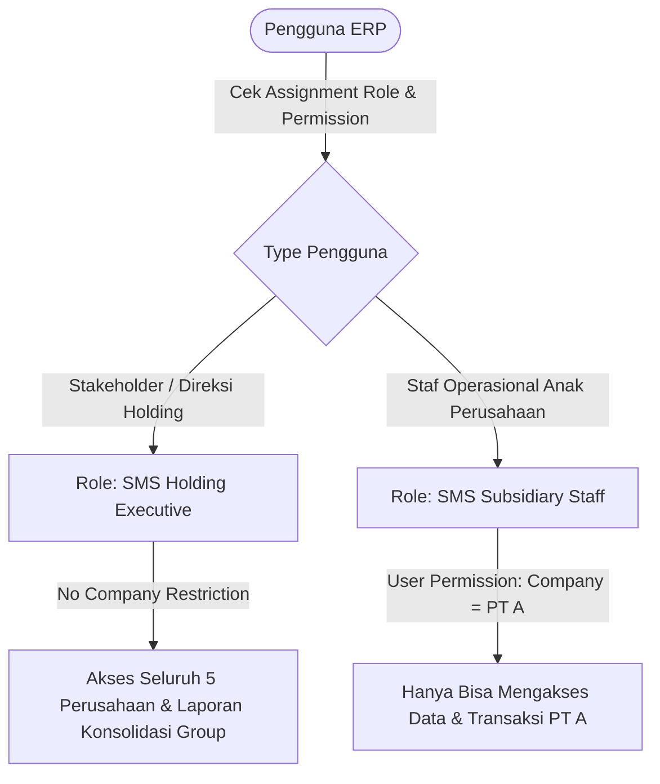

# SECURITY_AND_PERMISSIONS.md — Security & Access Control Framework (Multi-Company Enabled)

## 🔐 1. Multi-Company & Role-Based Access Control (RBAC)

Arsitektur keamanan **ERP-SMS** memisahkan wewenang antara **Pengguna Anak Perusahaan (Subsidiary Staff)** dan **Pemangku Kepentingan (Stakeholders / Direksi Holding)**.



---

## 🛡️ 2. Daftar Peran (Roles Profile Matrix)

| Nama Role Profile | Tingkat Akses (Company Scope) | Hak Akses Utama |
|---|---|---|
| **SMS Holding Executive** | 🌐 Global (Seluruh 5 PT) | Read-only & Dashboard Access ke seluruh transaksi, Laporan Laba/Rugi Konsolidasi, Monitoring Stok & Klaim Group |
| **SMS Insurance Assessor** | 🏢 Restricted per PT | `SMS Insurance Claim` (C, R, W, S), `SMS Insurance Policy` (R) |
| **SMS Counter Desk** | 🏢 Restricted per PT | `SMS Service Intake` (C, R, W), `Customer` (C, R, W), `Serial No` (R) |
| **SMS Service Technician** | 🏢 Restricted per PT | `SMS Service Order` (R, W), `Stock Entry` (Request Parts) |
| **SMS Warehouse Manager** | 🏢 Restricted per PT | `Stock Entry` (C, R, W, S), `Warehouse` (R, W) pada PT terkait |
| **SMS Finance Manager** | 🏢 Restricted per PT / Holding | `Sales Invoice` & `Journal Entry` pada PT terkait |

---

## 🔍 3. Data Isolation dengan User Permissions (Aturan Isosiasi Multi-PT)

Untuk mencegah kebocoran data antar anak perusahaan:

### 1. Isolasi Staf Anak Perusahaan (PT 1 s/d PT 5)
Setiap user operasional otomatis terikat pada 1 nilai `Company`:

```python
# Script otomatis pembatasan akses User ke PT spesifik:
def set_user_company_isolation(user_email, company_name):
    # Restrict Company
    user_perm = frappe.new_doc("User Permission")
    user_perm.user = user_email
    user_perm.allow = "Company"
    user_perm.for_value = company_name
    user_perm.apply_to_all_doctypes = 1
    user_perm.insert()
```

### 2. Stakeholder Access Policy (Akses Direksi Holding)
Para Stakeholder **TIDAK** didaftarkan dalam tabel `User Permission` untuk entitas `Company`. Dengan demikian, sistem Frappe secara otomatis mengizinkan Stakeholder membuka dashboard konsolidasi dan berganti konteks perusahaan (*Company Selector*) kapan pun dibutuhkan.

---

## 📜 4. Audit Trail & Security Logs

1. **Version History:** Seluruh perubahan limit polis, pengalihan stok antar PT, dan persetujuan klaim terekam lengkap dengan `User ID` dan `Company ID`.
2. **Inter-Company Audit Log:** Mengawasi transaksi jual-beli internal (*Inter-Company Trade*) antar 5 anak perusahaan untuk mencegah manipulasi pajak/pembukuan.
