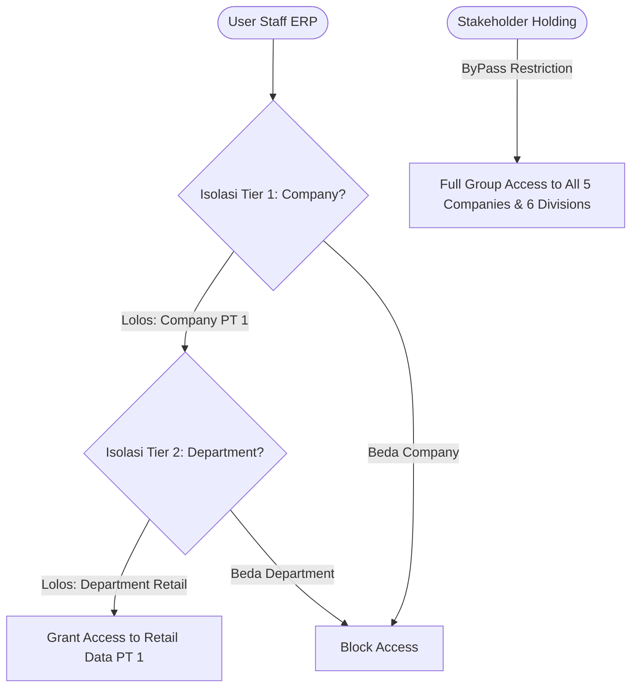

# SECURITY_AND_PERMISSIONS.md — Security & Access Control Framework (Full Matrix Architecture)

## 🔐 1. Dual-Tier Data Isolation (Company + Department)

Dalam arsitektur **Full Matrix 5 Perusahaan x 6 Divisi**, keamanan data diatur menggunakan dua lapisan pembatas (*Dual Security Guard*):



---

## 🛡️ 2. Aturan Permisi User (User Permission Assignment Rules)

### A. Konfigurasi User Staf Divisi (Contoh: Staf Retail PT 1)
```python
# User Permission 1: Batasi Perusahaan
frappe.get_doc({
    "doctype": "User Permission",
    "user": "retail.staff@pt1.com",
    "allow": "Company",
    "for_value": "PT SMS Region 1"
}).insert()

# User Permission 2: Batasi Divisi/Department
frappe.get_doc({
    "doctype": "User Permission",
    "user": "retail.staff@pt1.com",
    "allow": "Department",
    "for_value": "Retail - PT 1"
}).insert()
```

### B. Konfigurasi User General Manager PT (Contoh: GM PT 1)
- Memiliki `User Permission`: `Company = PT 1` (Tanpa batasan `Department`), sehingga GM PT 1 bisa mengawasi ke-6 divisi di dalam PT 1 saja.

### C. Konfigurasi Stakeholder Holding / Direksi
- **TIDAK** didaftarkan dalam `User Permission` `Company` maupun `Department`.
- Memiliki Role **`SMS Holding Executive`**, memberikan wewenang penuh untuk melihat laporan konsolidasi seluruh 5 Perusahaan dan 6 Divisi.
